# Git

	Git是目前世界上最先进的`分布式版本控制`系统，在多人团队开发时用来代码同步协作、历史版本控制等功能，是团队项目开发必不可少的工具软件。
	
	Git 是 Linus Torvalds 为了帮助管理 Linux 内核开发而开发的一个开放源码的版本控制软件。
	01
	大神之作，必是精品！

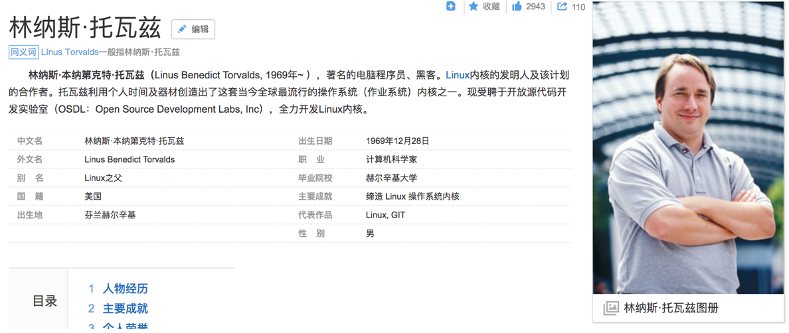


# 安装

从官方网站下载安装即可：

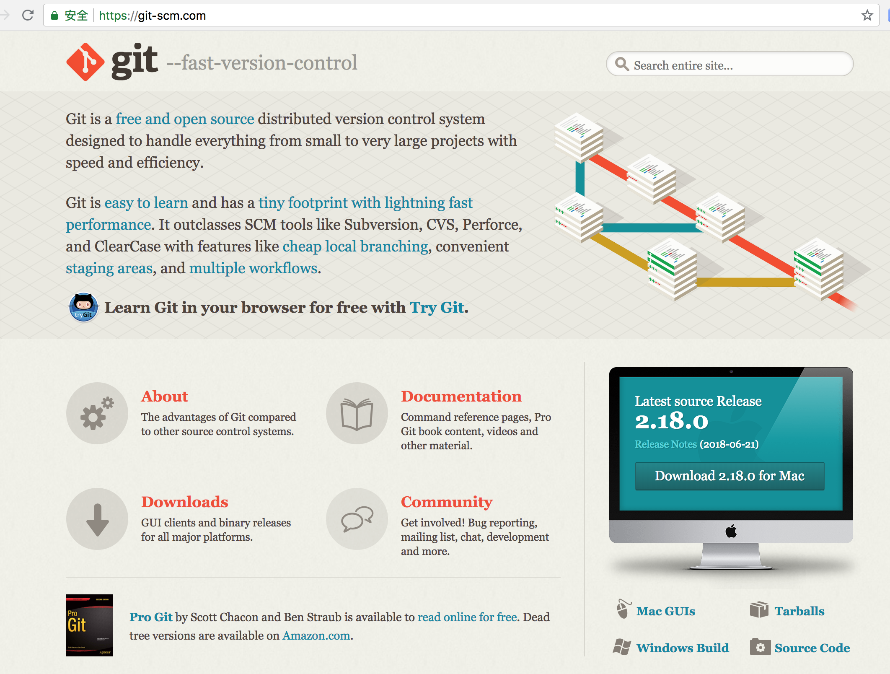


# 配置

在使用 Git 之前需要先进行一些必要的配置，其中用户名和邮箱是必须要配置的。

使用以下指令配置自己的用户名和邮箱：

~~~
git config --global user.name "John Doe"
git config --global user.email johndoe@example.com
~~~


# 初始化项目

当我们需要使用 Git 来管理我们的项目代码时，我们首先需要做的是先把我们的项目目录初始化成一个 Git 的仓库，然后就可以使用 Git 的指令来管理我们的项目代码。

初始化一个 Git 仓库有两种办法：

1. git init ：在本创建一个新的仓库。
2. git clone：从一个远程服务器下载代码到本地，然后先创建仓库。


## git init

使用 `git init` 指令我们可以把一个本地目录初始化为一个 Git 仓库。

初始化的目录即可以是一个空目录，也可以是非空的目录。

执行了 `git init` 指令之后，会在目录中创建一个 `.git` 目录，这个目录默认是隐藏的，里面保存了所有 git 管理仓库使用的数据，我们一般不用管它。


**示例、**把一个目录初始化为 git 仓库

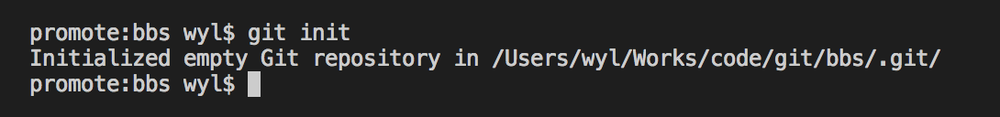


## git clone

如果我们希望从 git 服务器上下载项目并在本地生成 git 仓库，我们可以使用 `git clone` 指令：

```
git clone git仓库地址 [生成目录名]
```

当使用 `git clone` 指令时，如果不指定目录名，那么会在本地生成一个和项目同名的目录，如果指定目录名则会生成我们指定的目录名。


**示例、**从 github 上下载 laravel/laravel 仓库到本地

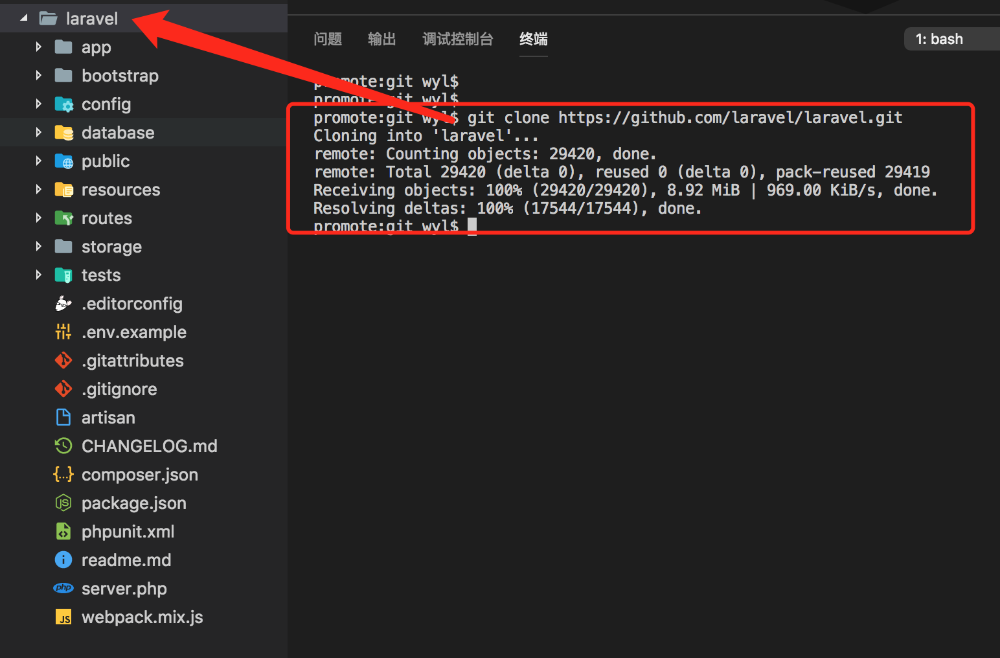


# 三个区域

git 仓库在管理代码时分为三个区域：`工作区域`、`暂存区` 和 `历史提交区`。

工作区域：就是我们的项目目录，我们在这里编写代码。

暂存区和历史提交区是在项目目录中的 `.git` 目录中，我们不能直接查看，需要使用指令来操作。

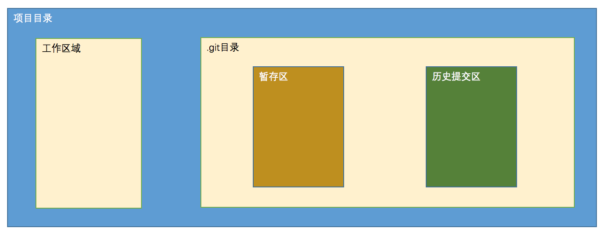


# 提交

提交：把文件从工作区域提交到历史提交区的过程。

每个提交都会在历史提交区中形成一个永久存在的版本，之后我们可以任意的在不同的版本之间切换，就像拥有了一台时间机器一样，我们可以把代码回退到一周前的样子，一个月前的样子，一年前的样子等任意一个之前提交时的历史版本。


## 常用指令

Git 中提供了大量的指令来实现各种操作，其中最常用的几个指令如下：
*提交*
- `git add -A`：把所有修改过的文件（包括新建、删除的文件）的文件提交到暂存区。
- `git add index.php`:提交单个文件
- `git add *.js`:使用通配符提交
- `git commit -m '注释'`：把暂存区中的内容提交到历史提交区
*清理*
- `git checkout -f`：丢弃所有提交到暂存区中的修改（恢复代码到未修改之前的样子）
- `git checkout .`:同上
- `git clean -fd`:删除没有add的文件和目录
*Log*
- `git log`:查看日志
- `git log -p -2`:查看最近2次提交日志并显示文件差异
- `git log --name-only`:显示已修改的文件清单
- `git log --name-status`:显示新增、修改、删除的文件清单


- `git reset --hard 历史版本号`：把代码回退到任意一个历史版本（一般结合 `git reflog`  和 `git log` 指令一起使用）

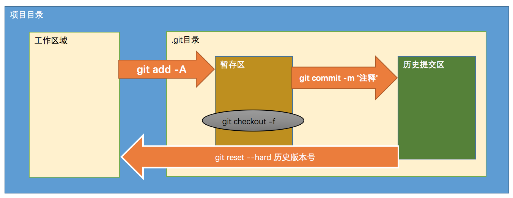


## 文件状态

git 在管理代码时把文件分成以下两大类：

- untracked（未追踪）：还未加入到仓库区中的文件
- tracked（已追踪）：已经在历史提交区中的文件

tracked 分类下的文件又可以分为：

- modified：被修改的。
- deleted：被删除的。
- unstaged：被修改了但还未加入到暂存区中的

我们可以使用 `git status` 指令来查看当前代码的状态，或者使用 `git status -s` 来查看一个更加简洁的状态信息。


## 提交新文件

接下来我们演示一个在项目中添加新文件的提交流程。


1、当没有任何被修改时的状态 

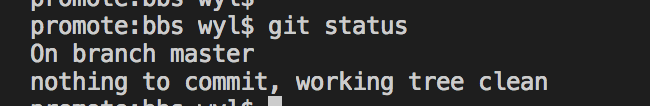

2、添加了新文件但还没有添加到暂存区中

这时显示 3.html 还未被追踪（红色）

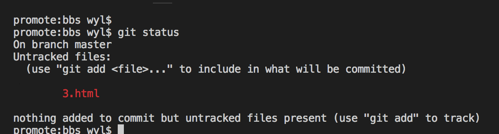

3、把文件添加到暂存区中，然后查看状态

显示 3.html 是一个新文件，已经在暂存区中了（绿色）

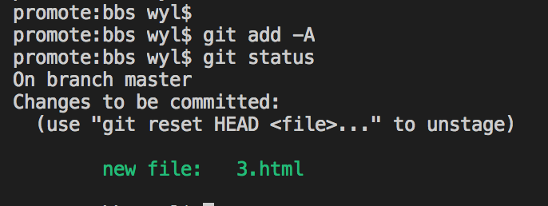

4、提交到历史版本区，然后查看状态

提交之后，显示当前工作目录很干净（所有被修改的文件都提交了）

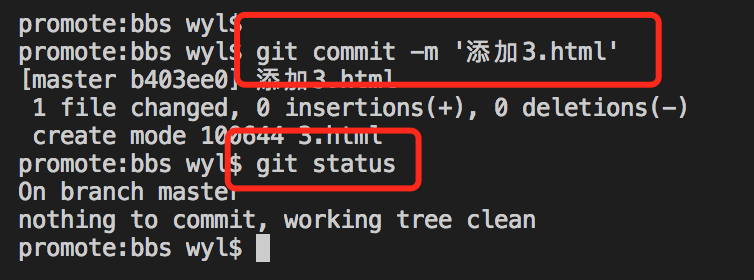

注意：提交时一定要使用 -m 设置一个说明文本，如果没有添加 -m 参数，那么在提交时会打开一个系统默认的编辑器强制我们必须输入说明文本。

这样我们就把新文件添加到历史版本中了。


## 提交修改

接下来我们来演示，当修改一个已有文件时的提交流程。


1、修改一个已经被追踪的文件

3.html 文件我们已经提交过了，也就是这个文件已经被追踪了，这时如果我们修改这个文件再查看状态：

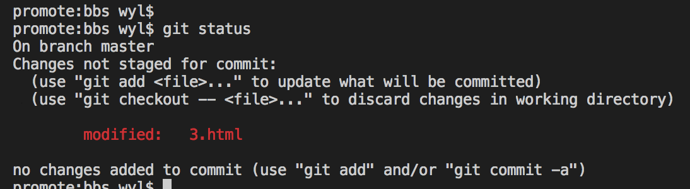

会显示 3.html 被修改了，而且这次的修改还没有被添加到暂存区中（红色）

2、把这次修改添加到暂存区中

显示这次的修改已经添加到暂存区中，可以提交了

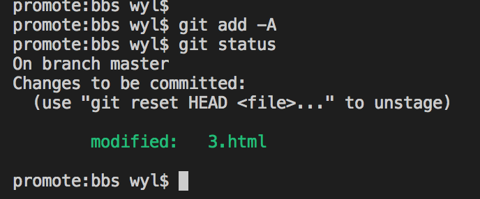

3、提交到历史版本区

修改已经加入到暂存区了，接下来我们就可以提交了：

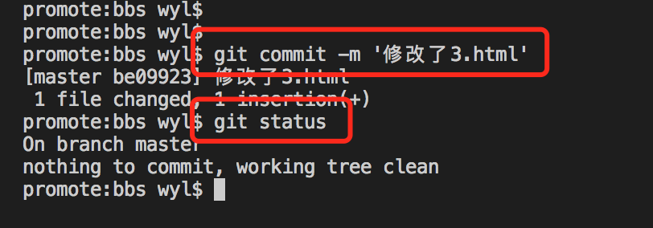

提交之后再查看状态，目录已经变回干净状态了。


## 撤销修改

接下来，我们来演示一下如何撤销自己所有的修改。

如果我们修改了一些文件之后，突然又不想修改了，想恢复到未修改之前的样子，可以执行以下两个指令：

```
git add -A         // 把所有修改添加到暂存区中
git checkout -f    // 丢弃暂存区中所有的内容
```


1、先在项目中做一些修改

新建 4.html 文件

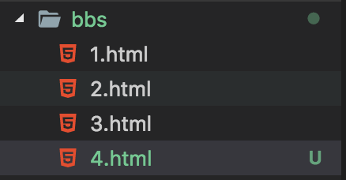

修改 3.html 文件中的内容

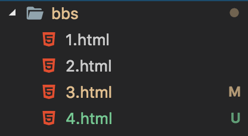

删除 1.html 文件

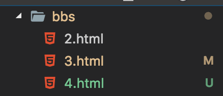

查看当前的状态：

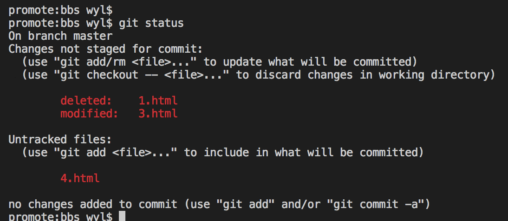

显示有三个文件了，并且都没有添加到暂存区中（红色）

2、恢复所有修改过的文件

现在如果我们想要把这三个修改过的文件都恢复到未改之前的样子，可以这样做

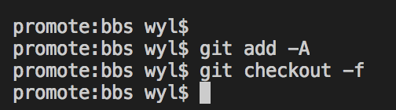

执行完这两个指令之后，发现代码又恢复到未修改之前的样子了：

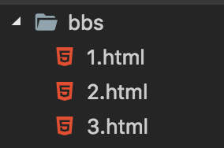

并且查看状态也变回干净的状态了：

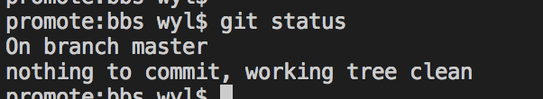


# 忽略 


```
项目中的有些文件，我们是不希望 Git 对其进行管理的，比如，项目在运行时生成的一些临时文件、缓存文件等，这时我们就可以创建一个名字为 `.gitignore` 的文件，然后在文件中写上希望 git 忽略的文件及目录。
```


## .gitignore 文件

要使用忽略文件，我们需要在项目的根目录中添加 `.gitignore` 文件并提交到仓库中。


1、根目录中创建 .gitignore 文件

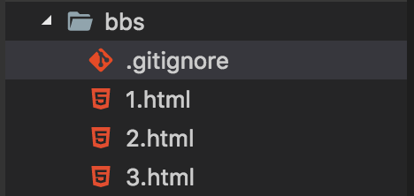

2、提交到版本库中

```
git add -A
git commit -m '添加 .gitignore 文件'
```


## .gitignore 语法

.gitignore 文件中的基本语法是：

1. 以 # 开头的行是注释
2. 可以使用类似简化的正则表达式，所有匹配的文件都会被忽略
3. 可以使用 / 开头，以指定根目录文件，而不是所有目录
4. 可以使用 / 结尾，以指定忽略某个目录中的内容
5. 可以使用 ! 开头以取消忽略

```
# 忽悠所有 .a 文件
*.a

# 不忽略 lib.a 文件，即使前面已经忽略了所有 .a 文件
!lib.a

# 只忽略当前目录下的 TODO 文件，子目录中的 TODO 文件不忽略
/TODO

# 忽略 build 目录下所有的文件
build/

# 忽略所有 doc 目录下的 .txt 文件，但 doc/子目录下的.txt文件不忽略
doc/*.txt

# 忽略所有 doc 目录及子目录下的 .pdf 文件
doc/**/*.pdf
```


示例、忽略 根目录下 /public/uploads 目录

1、在 .gitignore 文件中添加

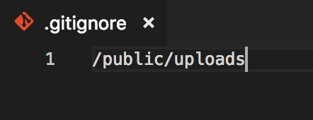

2、提交到仓库中

```
git add -A
git commit -m '忽略 /public/uploads 目录'
```


提交之后，我们再项目中创建 /public/uploads 目录，并在目录中新建一些文件和目录：

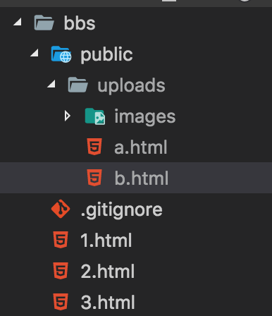

执行 `git status` 查看项目中文件的状态，发现显示项目是干净的并没有任何变化，这就是因为 git 忽略了 /public/uploads 目录，所以我们无论如何修改这个目录中的内容 git 都会视而不见。

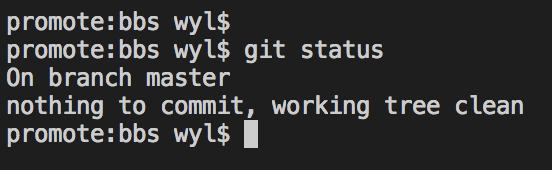


注意：如果一个文件或者目录已经在仓库中了，之后再忽略是不会生效的，需要先从仓库中删除之后才能生效。


# 签出

签出：指从历史版本仓库中取出某个版本的代码到工作目录。

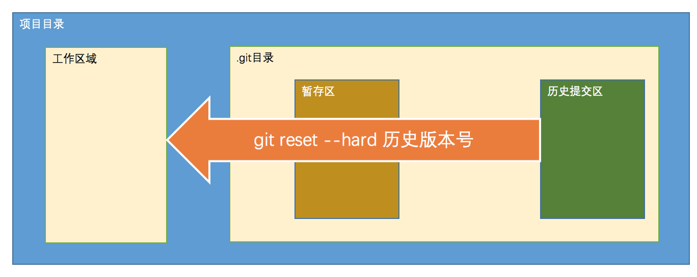


## 查看日志

Git 有一个日志会记录我们每次执行 `git commit` 指令提交的代码。我们可以使用 `git log` 查看提交日志。

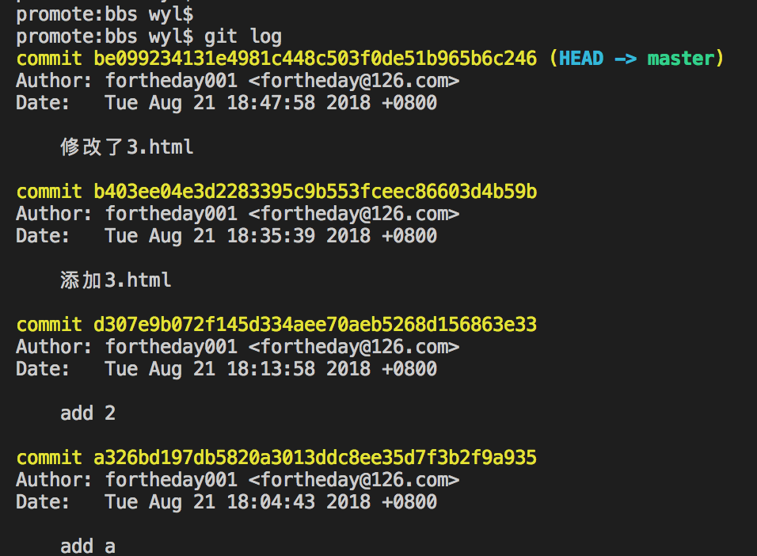

上图中每条日志都由四部分组件：唯一版本号、提交人、提交时间、提交的说明文本。


## 切换版本

我们可以使用 `git reset` 指令签某个特定的历史版本。

```
git reset --hard 历史版本号
```

答出某个版本之后，我们的工作目录就会变成那个版本的代码。

说明：使用历史版本号时，只要使用前5位即可。


示例：切换代码到第三个版本（版本号：d307e...）

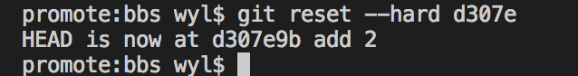

签出之后发现我们的工作目录中的代码就变成 d307e 开头的这个版本了。


## 回到最新版本

我们刚刚回退到了一个较早的历史版本，如果我们现在想要再回到最新的版本该怎么办呢？

首先，我们需要查找出最新版本的版本号，于是我们执行 `git log` 查看日志：

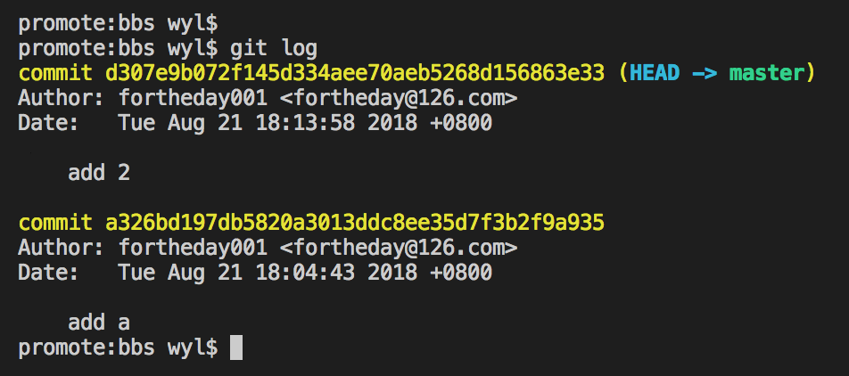

这时我们发现只列出了再往前的历史版本日志，这里并不会列出它之后的版本：

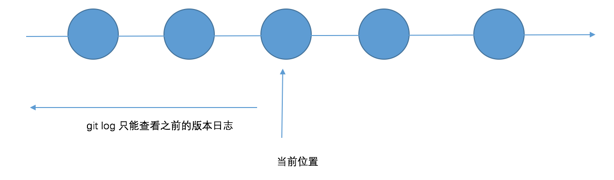

现在我们无法查看后面最新的版本号了，现在该怎么办呢？

我们可以使用 `git reflog` 指令。

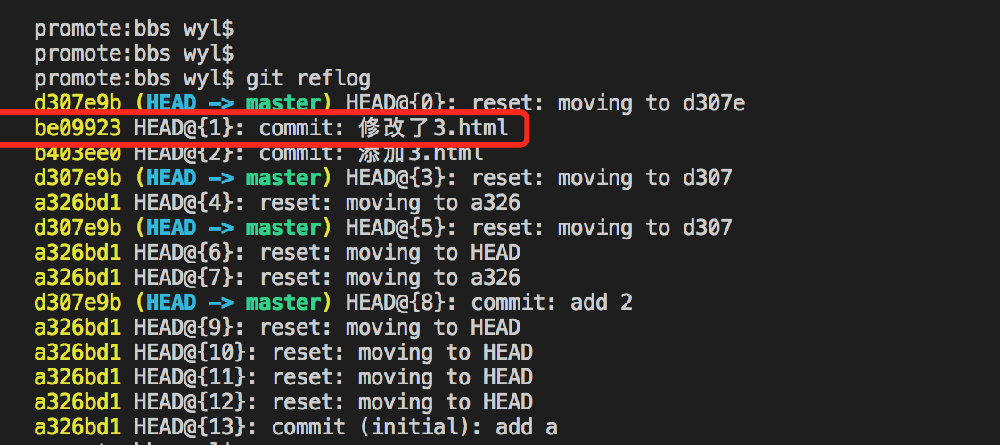

这个指令会列出所有之前执行过的所有指令历史，从图中可以看出，我们在移动到 d307e 之前是在 be09923 这个版本号，这就是移动前最新的版本号，现在知道了版本号，我们就可以回到未来了：

```
git reset --hard be09923
```


## 小结

`git reset` 指令像时间机器一样，可以让我们在历史的各个版本中切换我们的代码。

切换代码的基本流程：

1. 回到过去：`git log` 查看历史版本号，  `git reset --hard 历史版本号`
2. 回到未来：`git reflog` 查看历史所有的操作，找出未来的版本号，`git reset --hard 未来版本号`


注意：被忽略的文件和目录不受影响。


# 分支

分支是 Git 中一个杀手级的功能，在 Git 中创建分支的成本非常低，所以我们可以创建做任意多个分支来管理我们的项目代码。

分支就是科幻小说中的平行宇宙一样：有共同的历史、彼此完全独立。

下图中演示了四个分支，其中这些分支最初都是从 `master` 分支衍生出来的：

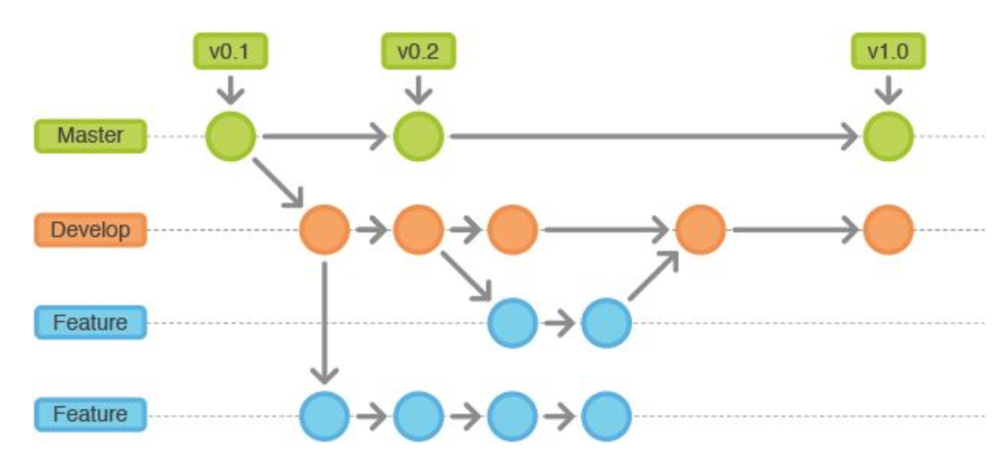

图中的四条横线代表四个分支，横线上的圆圈代表该分支上的每个提交（git commit）。


使用好分支是管理代码以及团队协作必不可少的技术，接下来我们就来学习如何使用分支。


**master 分支**

每个 Git 仓库都有一个默认的分支：master ，其实我们一直都是在 master 这个分支上在工作。

所以其它的分支都是从这个 master 分支衍生出来的。


## 基本指令

操作分支使用以下几个指令：

`git branch` ：查看仓库中所有分支。

`git branch 新分支名`：创建新的分支，但不切换分支

`git checkout 分支名` ：切换到分支

`git branch -d 分支名`：删除一个分支

`git checkout -b 新分支名`：创建分支，并切换到这个分支

`git merge 分支名` ：把分支合并到当前分支上


## 查看分支

我们可以使用 `git branch` 指令查看刚仓库中所有的分支：

```
git branch
```

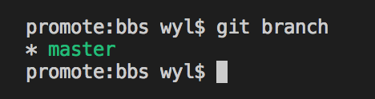

默认项目中只有一个 `master` 分支，分支前面的 * 代表我们当前代码所在的分支，画图表示是这样：

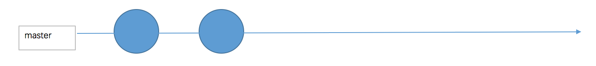

上图表示，只有一个 master 分支，并且该分支上有两次提交（git comiit）。


## 创建分支

要想创建新的分支还是使用 `git branch` 指令：

```
git branch 新分支名
```

除了这个指令之后，我们也可以使用 `git checkout` 指令创建并切换分支：

```
git checkout -b 新分支名  # 创建并切换分支
```


示例、创建 tom 分支并查看分支情况：

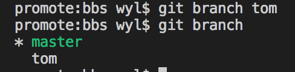

从图中可以看到，多出了一个 tom 分支，master 前面的 * 号代表，我们当前是处在 master 分支上。

该操作相当于，我们从当前提交点上创建出了一个平行世界，而我们处在 master 这个世界中：

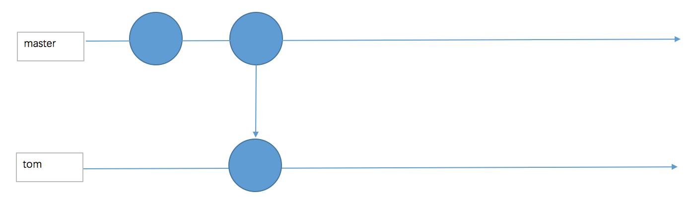


## 切换分支

如果我们希望切换到其它分支上进行工作的话，我们可以使用 `git checkout` 指令：

```
git checkout 分支名
```

示例、切换到 tom 分支

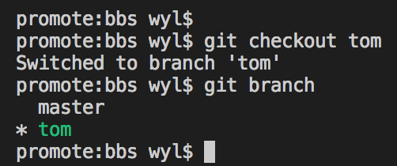

从图可以看出现在 tom 前面多了一个 * ，代表我们现在是在 tom 这个分支上。

接下来我们对代码进行修改并提交

1、新建一个 tom.html 的文件

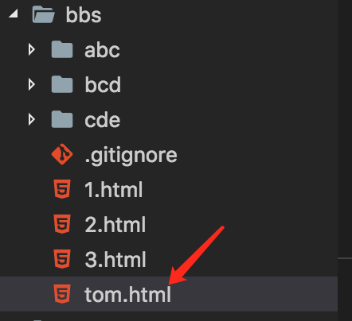

2、提交到仓库

```
git add -A
git commit -m '添加 tom.html'
```

执行了该操作之后，我们就在 tom 这个分支上向前走了一步（多了一次提交）


如上图，tom 分支上多了一次提交，黄色箭头代表我们现在所在的位置。

如果此时我们再切换回 master 分支会有什么变化呢？

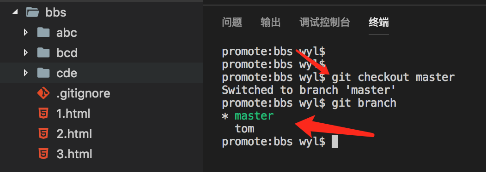

如上图，当我们切换回 master 分支之后发现 tom.html 文件不见了，这是因为现在是在 master 分支上，在这个分支上是没有 tom.html 这个文件的（惊不惊喜，神不神奇）：

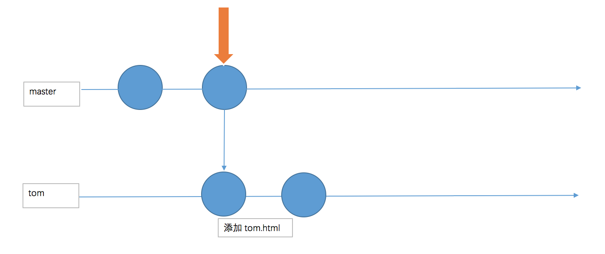

如上图所示，我们回到了 master 分支，黄色箭头代表我们的位置。


注意：当我们切换分支时，项目中的代码会跟着发生变化。

这时我们再切换回 tom 分支，发现 tom.html 文件又出来了：

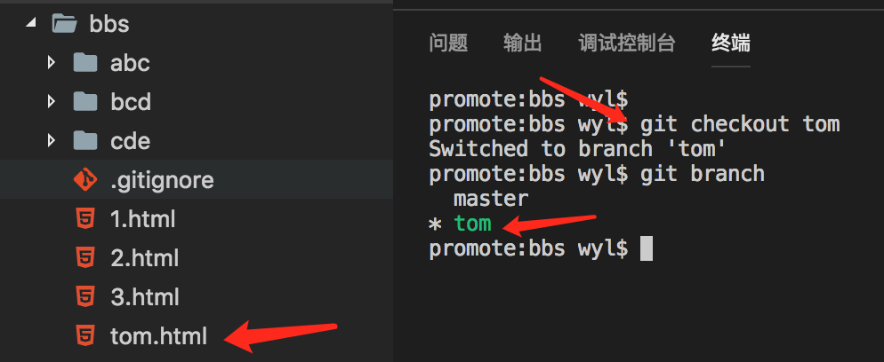

如图我们又回到 tom 分支了：

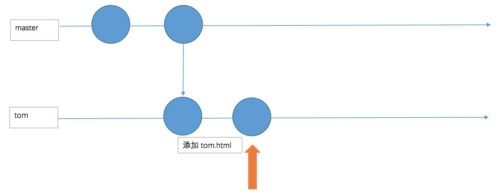

## 合并分支

无论有多少个分支，我们最终都需要把其它分支的代码合并到主分支上来。

一般 `master` 分支是项目中永远会存在的分支，而其它分支一般都是临时性，主要用来在一个独立的环境中开发新功能，这样不会影响到其它功能和原来的代码，新功能开发完之后要把代码合并回 master 分支。

合并分支的指令：

```
git merge 其它分支名    // 把其它分支的代码合并到当前分支上
```


示例、将 tom 分支上的代码合并到 master 分支

1. 切换到 master
2. 将 tom 分支合并过来

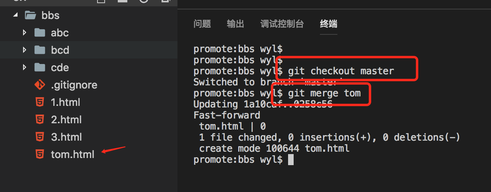

如上图，执行了合并之后，我们发现 tom.html 这个文件也合并到 master 分支上来了，现在 master 和 tom 分支上的文件代码一模一样了。


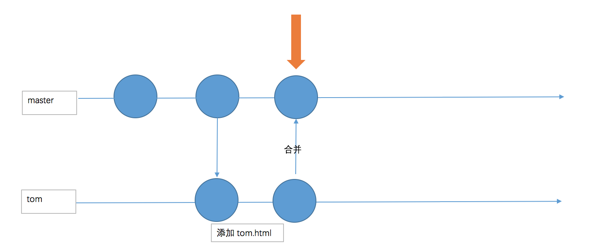


示例练习：完成下图中 git 的操作：


## 冲突

冲突：多个分支同时修改了同一个文件中的同一行代码。

上面的例子中我们只有两个分支，情况比较简单，在实际的团队开发中，可能会同时存在多个分支，团队中的每个成员都在自己的分支上开发代码，最终都合并到 `master` 分支上。

这时如果在多个分支上都修改了同一个文件中的同一行代码，这时当合并到 master 分支时就会发生冲突！在实际开发中，团队越大发生冲突的机率越高。

接下来，我们举例来演示一下，冲突是如何发生的。

1、从 master 分支再分支出一个 jack 分支

```
git checkout master   // 先切换到 master 分支
git branch jack       // 创建 jack 分支
```

创建 jack 分支之后，分支情况如下图：

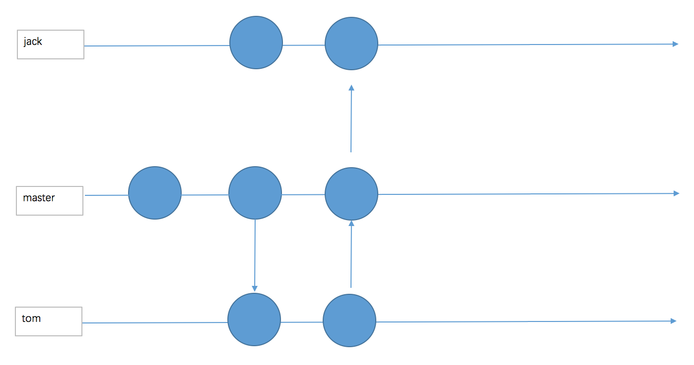

2、两个分支上修改代码

我们在 tom 和 jack 分支上都修改 tom.html 文件中的第一行代码

tom 分支

```
git checkout tom   ## 切换到 tom 分支
```

```
并修改 tom html
```

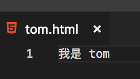


```
提交
```

```
git add -A
git commit -m '修改 tom.html 第一行'
```

```
提交之后，tom 分支上就向前走了一步：
```

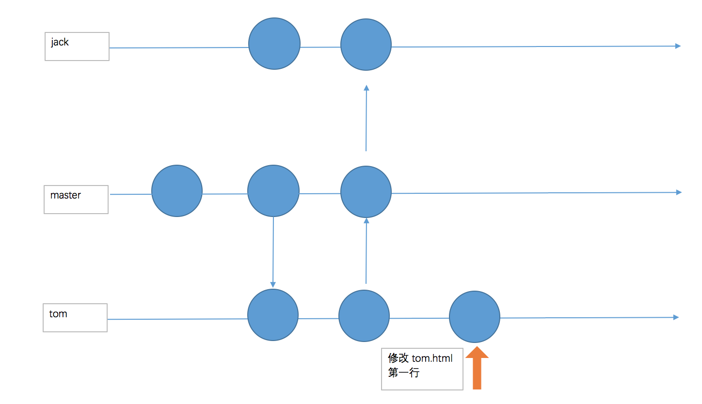


jack 分支

```
git checkout jack   ## 切换到 jack 分支
```

```
并修改 tom.html


提交
```

```
git add -A
git commit -m '修改了tom.html第1行'
```

```
提交之后，jack 分支上向前走了一步：
```

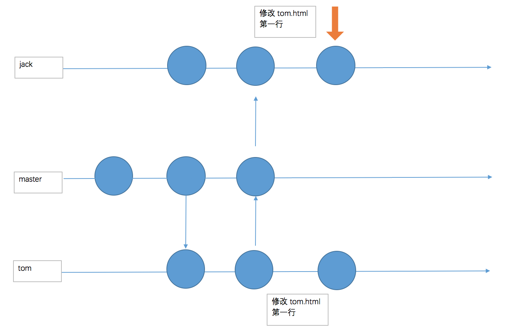

3、合并两个分支到 master

现在两个分支中的代码都编写完了，需要合并到 master 分支上。两个分支谁先合并到 master 都可以，在实际开发中，谁先合并也都不一定，一般谁先写完谁先合并。

将 tom 合并到 master 上：

```
git checkout master   # 先切换到 master 分支
git merge tom         # 将 tom 分支合并到 master
```

合并过程很顺利没有发生任何问题。

接下来我们再来合并 jack 分支：

```
git merge jack      # 合并 jack 到 master
```

这时就提示发生冲突的错误了，提示 tom.html 文件发生了冲突（在 vscode 中是紫色并且有个 C 字母）：

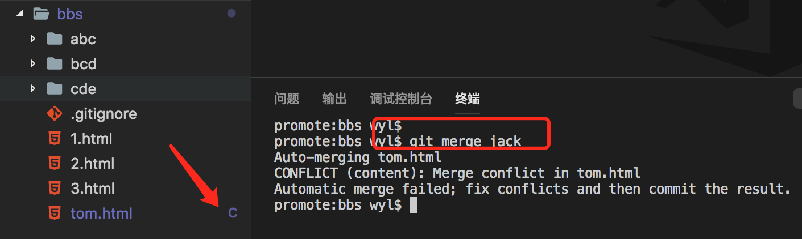

我们打开 tom.html 看看里面的情况：

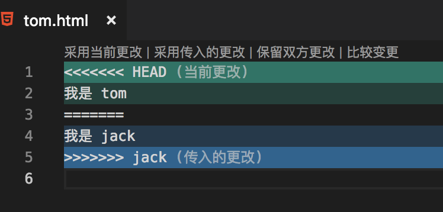

在 tom.html 文件中会把 tom 和 jack 写的代码都写在这个文件中，通过 <<<<...===...>>> 来分隔，代码中上面的 === 上面的部分为当前的代码，==== 下面的部分为要合并的代码，因为这两个提交都修改了同一行，所以 git 不知道谁的才是对的，于是就都显示了出来，让我们来解决应该采用哪个分支上的代码。这就是冲突！

在实际工作中，如果是多人同时开发，就会出现冲突的情况，遇到冲突我们就要解决冲突，接下来我们来学习如何解决冲突。


## 解决冲突

解决冲突非常简单，就是：”删除所有冲突符号，保留最终正确的代码！“

比如上面的冲突中，tom 和 jack 都修改了第一行代码，那么到底谁是对的应该保留谁的代码呢？这时一般就会进行团队讨论，tom 和 jack 两个人打个电话沟通一下。

如果最终确定 jack 的代码是对的，希望最终保留 jack 的代码，那么我们只需要把 tom 的代码以及 <<< >>> ===这些特殊符号删除，只保存 “我是 jack” 即中。

在 vscode 编辑器中为我们提供更加快速的操作，如图有四个按钮，点击一个即可：

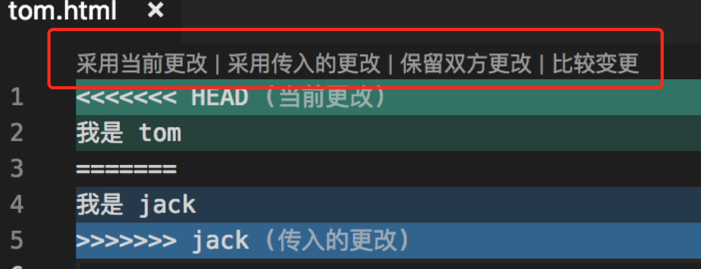

这里我们需要使用 jack 的代码，那么只要点击 `采用传入的更改` 即可，点击之后编辑器帮我们删除了所有特殊符号并把 jack 的代码保留了下来：

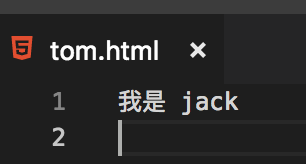

到此我们就把冲突的代码解决了，最后我们还需要把解决了冲突之后的文件重新提交一下：

```
git add tom.html
git commit -m '解决 tom.html 的解决'
```

OK，到此冲突解决了，tom 和 jack 分支上的代码已经全部合并到 master 上了。


经验总结：团队开发时，经常会在合并代码时出现冲突，首先，合并代码时出现冲突是很正常的事情。但同时，也要注意，当冲突太多时可能会导致解决起来非常困难，甚至无法解决！

为了避免合并代码时冲突带来的麻烦，我们应该定期合并代码，比如一天、三天，最多不要超过一周。如果一个分支太久没有合并过，会导致和主分支的差异越来越大，最后导致无法合并的情况，这点同学们一定要注意。


## 删除分支

有一些分支是用来修改 BUG 、测试一些新特性的临时分支，这种分支用完就可以删除了，删除分支可以使用以下指令：

```
git branch -d 分支名
```

示例、删除 tom 分支

```
git checkout master  # 切换到 master (先离开 tom 分支)
git branch -d tom    # 删除 tom 分支
```

## 储藏
当你正在进行项目中某一部分的工作，里面的东西处于一个比较杂乱的状态，而你想转到其他分支上进行一些工作。问题是，你不想提交进行了一半的工作，否则以后你无法回到这个工作点。

"暂存" 可以获取你工作目录的中间状态 —— 也就是你修改过的被追踪的文件和暂存的变更 —— 并将它保存到一个未完结变更的堆栈中，随时可以重新应用。

储藏工作 git stash
查看储藏列表 git stash list
应用最近的储藏 git stash apply
应用更早的储藏 git stash apply stash@{2}
删除储藏 git stash drop stash@{0}
应用并删除储藏 git stash pop


# 远程

我们之前所有的操作都是在本地完成的，都是操作的 `本地仓库`。

在团队协作时，我们必须要有一个远程的中央仓库，借助中央仓库团队中的成员才能同步代码。


## Git 服务器

为了实现团队成员之间同步代码，我们需要有 `Git 服务器`。我们可以自己搭建一个服务器也可以使用第三方的代码托管平台。


### 自己搭建

为了代码的安全一般公司内部都会搭建一个私有的 Git 服务器，这个服务器只有公司内部的开发人员才可以访问。

如果要搭建 Git 服务器，目前最常用的开源软件：

1. GitLab

   优点：功能丰富

   缺点：需要消耗内存资源

2. Gogs

   优点：轻便、方便、节省资源

   缺点：功能相对单一


1、网速

2、安全


具体的搭建方法这里不演示了，有兴趣的同学可以自行百度。


### 第三方平台

如果对代码没有特别高的安全要求，也可以使用第三方的代码托管平台做为服务器，

1. [GitHub](http://www.github.com)

   世界上最大的代码托管平台。

2. [码云](https://gitee.com/)

   国内的代码托管平台。


## GitHub

GitHub 是世界上最大的代码托管平台，全世界有很多著名的开源项目的代码都托管在上面，使用 GitHub 已经成为所有开发人员的必备技术。

接下来我们演示如何使用 GitHub 来托管我们的代码。


### 注册

首先，我们需要在 GitHub 上注册一个账号。

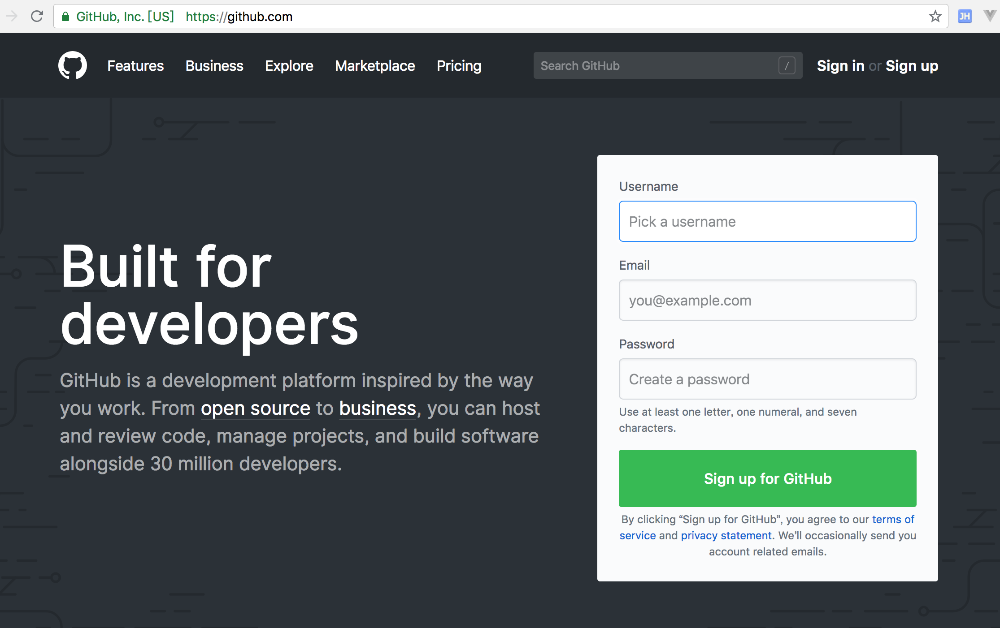


### 登录

注册登录之后，会进入我们的主页面，在这里我们可以创建新仓库和查看现有的仓库

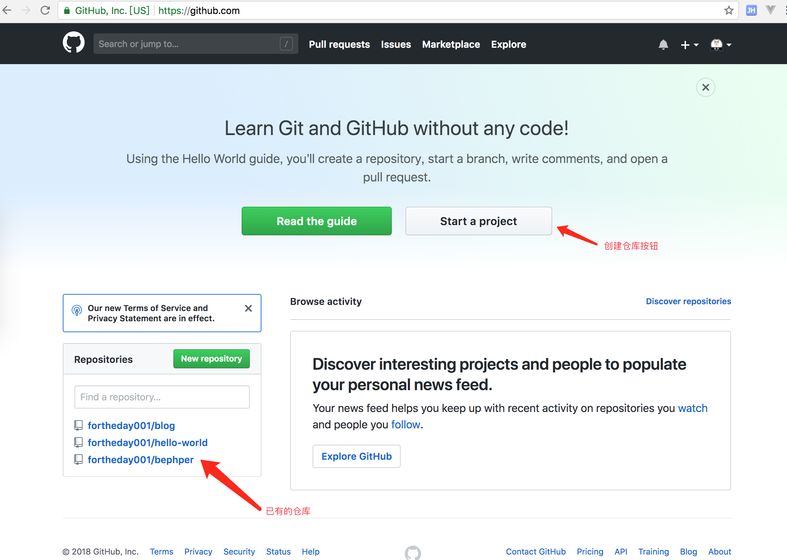


### 新建仓库

接下来我们新建一个 good_good_study 的仓库.

1、点击这个按钮

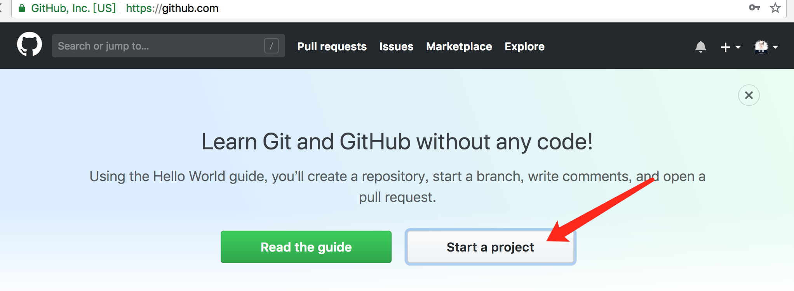


2、填写仓库的基本信息

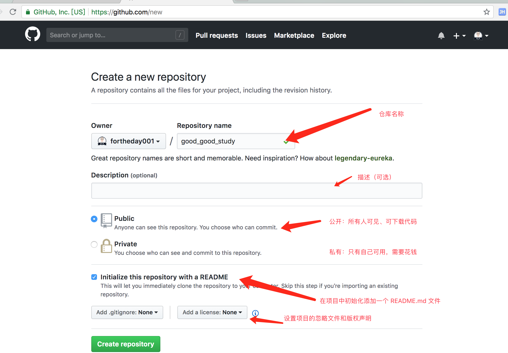

创建好项目之后，会跳到仓库主页面：

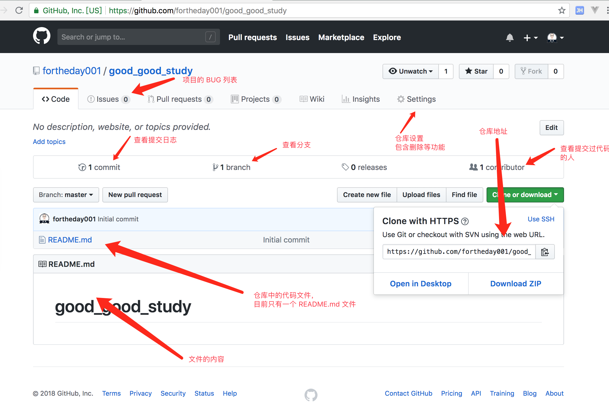

在这个页面中我们可以查看仓库所有的信息，包括分支、提交人、代码等等。

其中最重要的就是我们得到了我们这个仓库的地址：

`https://github.com/fortheday001/good_good_study.git`

有了这个地址之后，所有开发人员就下拉、推送自己的代码实现多人开发了。

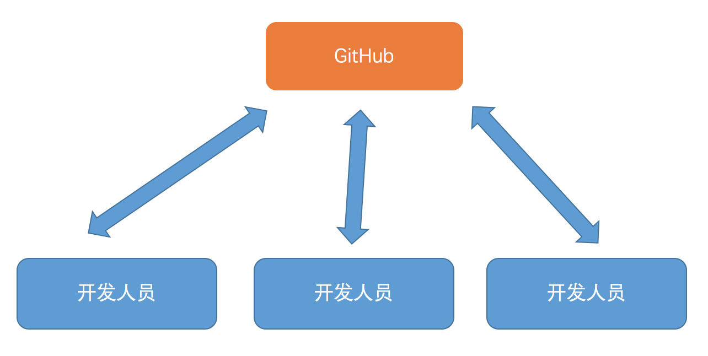


## 管理远程仓库

现在我们已经有了一个远程的仓库，仓库地址为：

`https://github.com/fortheday001/good_good_study.git`

接下来我们需要在本地创建一个仓库并和这个远程仓库关联起来，然后我们就可以在本地仓库中编写代码然后推送到远程服务器，也可以从远程服务器上下拉其他成员提交的代码，以此实现团队成员之间的代码同步。

将本地仓库和远程仓库关联有两种办法：`git clone` 和 `git remote`


### git clone

当我们需要从远程仓库下载并创建新的本地仓库时可以使用 `git clone` 指令：

```
git clone 远程仓库地址 [本地仓库目录名]
```

在克隆一个远程仓库到本地时，默认会创建一个本地仓库，并且名字和远程仓库的名字相同，我们也可以自己设置一个本地仓库目录名。

示例、克隆仓库到本地并生成名为 study 的本地仓库

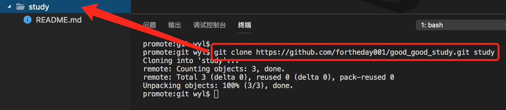

指令执行之后，在本地创建了名为 study 的本地仓库。


### git remote

如果我们本地已经有了一个仓库，我们希望把本地的这个仓库和一个远程仓库关联起来，这时候就需要使用 `git remote` 指令。

用法：

```
git remote      							// 查看所有已关联的远程仓库名称
git remote -v   							// 查看所有关联的远程仓库名称及地址
git remote add 名称 远程仓库地址   			   // 关联一个新的远程仓库
git remote remove 名称    				   // 删除一个关联的远程仓库
```


示例、把我们之前操作的本地仓库和远程关联。

1、先在本地仓库中使用 `git remote` 指令，显示还没有关联任何远程仓库：

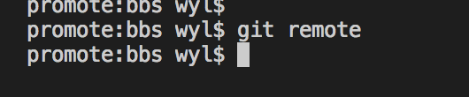


2、关联远程仓库

把本地仓库关联到远程仓库并为远程仓库起名来 origin （习惯于将关联的仓库起名为 origin）。
~~~git
##关联指令
git remote add origin https://github.com/JIAOBANTANG/123.git
git push -u origin master
~~~
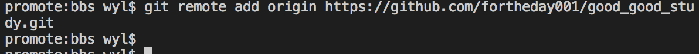


3、查看关联的远程仓库

查看已经有了一个叫做 origin 的远程仓库

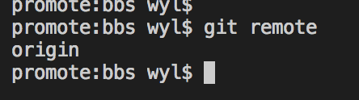

也可以添加 `-v` 参数查看名称及地址

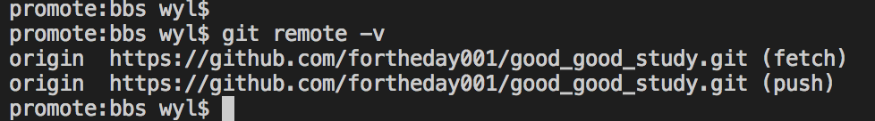


小结

1. git clone 用来克隆下载一个远程仓库并在本地创建一个新的仓库时使用。
2. git remote 用来将一个现有的本地仓库和远程仓库关联。


## 推送与拉取

当本地仓库和远程仓库关联上之后，我们就可以将本地的仓库推送到远程仓库，也可以将远程仓库上的代码拉取到本地仓库中。

推送指令：

```
git push
```

摘取指令：

```
git pull
```


### clone 项目的推送

如果本地的项目是使用 `git clone` 指令克隆下来的，那么克隆之后，本地的项目就已经和远程仓库关联起来了，这时就可以直接使用 `git push` 和 `git pull` 进行推送和拉取了。


示例、在本地克隆的项目中添加新文件并推送到远程服务器。

1、本地克隆项目中创建新文件

study 是我们前面克隆的项目，现在在项目中创建一个新的 clone.html 文件

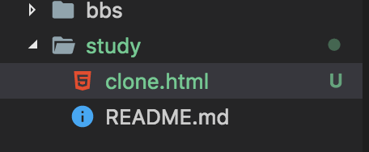

2、提交到仓库

添加了新文件之后，我们需要把它提交到版本库中：

```
git add -A
git commit -m '添加 clone.html'
```

注意：这里的提交是指把本地仓库中的文件提交到本地仓库中，千万不要和推送弄混了。

- 提交（git commit)：本地暂存区中的文件提交到本地仓库中
- 推送（git push）：本地仓库推送到远程仓库


3、推送到远程

现在我们在本地仓库中添加了一个新的文件，我们接下来把它推送到远程仓库上：

```
git push
```

推送时显示从本地的 master 分支推送到远程服务器上的 master 分支：

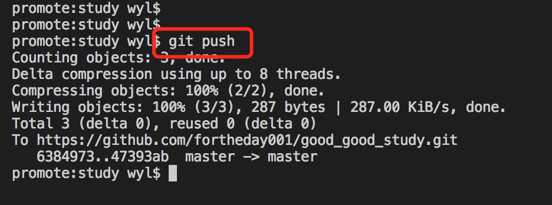

推送之后到远程服务器查看已经多了一个文件：

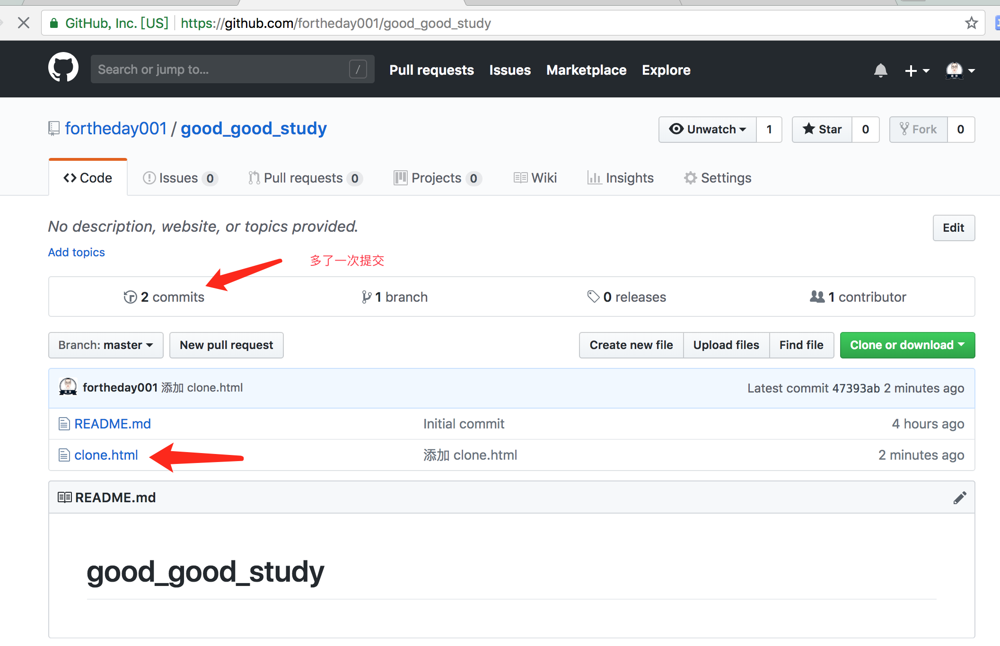


### 已有项目的拉取

上面演示的推送是指使用 `git clone` 指令创建的本地仓库时的操作。

如果一个本地项目原来就已经存在，然后使用 `git remote` 指令后关联到一个远程仓库时，这种仓库的推送和拉取略有不同。

示例、后关联仓库的拉取与推送。

我们本地的 bbs 仓库是我们之前就有的本地仓库，后来我们通过 `git remote` 指令把它关联到了远程仓库上，接下来我们来演示一下 bbs 这个本地仓库的操作。

1、拉取数据

因为远程仓库上现在有些文件，所以我们首先先把远程仓库上的代码拉取下来

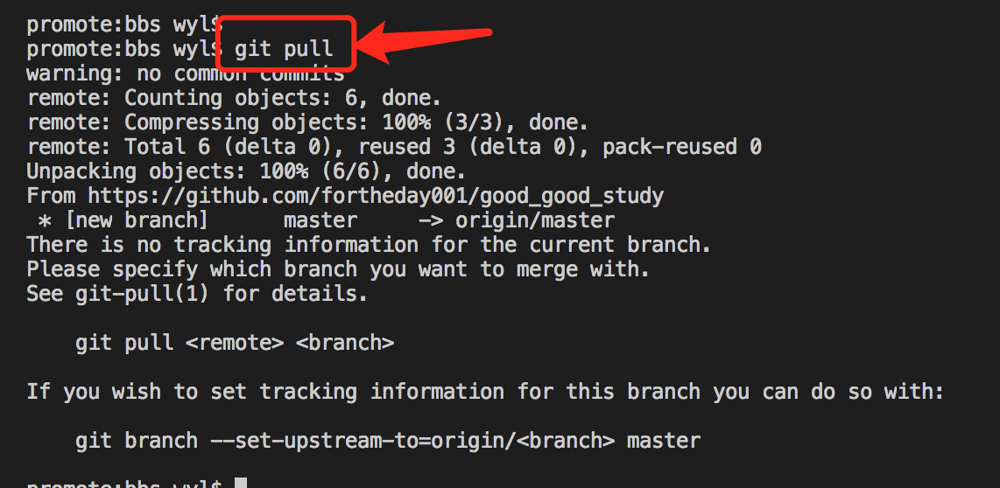

但是当我们执行拉取时会报错，提示：我们没有指定要拉取的分支，我们需要使用以下指令指明要拉取的分支：

```
git pull 远程名称 要摘取的分支
```

因为现在远程只有一个 master 分支，所以我们就拉取远程的 master 分支：

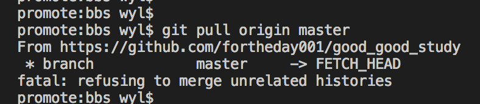

拉取时提供了另一个错误：不能合并不相关的历史。

提示这个错误是因为，我们本地的这个仓库和远程仓库虽然关联到了一起，但是它们并没有共同的历史（明明就是两个仓库，哪来的共同历史），所以不允许合并。

解决这个问题只需要在拉取时添加：`--allow-unrelated-histories` 参数即可：

```
git pull origin master --alow-unrelated-histories
```

执行指令之后，会让我们添加一个注释文本，说明我们为什么要拉取这些文件并合并到本地，添加完文本之后就成功合并到本地了，把远程仓库上的两个文件拉取到了本地：

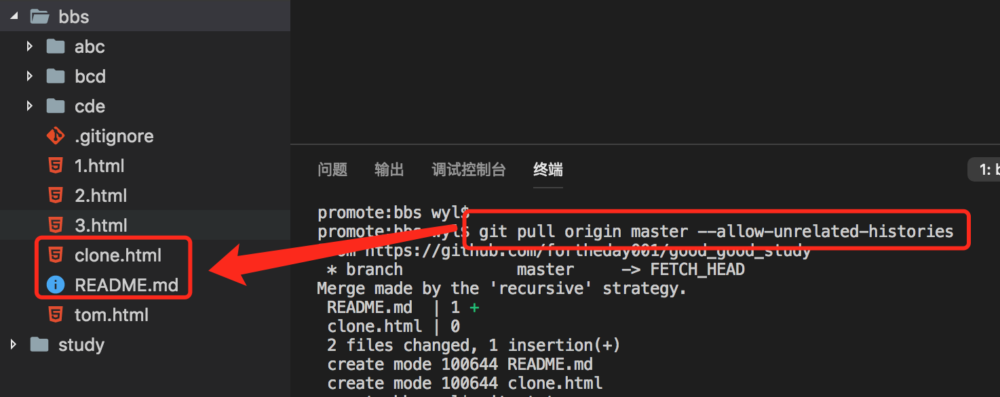


### 已有项目的推送

现在我们本地这个仓库中的文件比较多，我们需要把它推送到服务器上同步代码，这时可以使用 `git push` 指令，但是推送时会显示错误说没有指明上游分支：

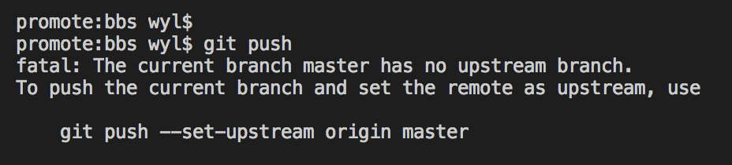


这时我们只需要在推送时添加一个 -u 参数以及要推送的分支即可解决：

```
git push -u 远程仓库名 要推送的分支名
```

目前我们本地只有一个 master 分支，所以我们把 master 分支推送到名为 origin 的远程仓库上：

```
git push -u origin master
```

该指令会推送数据并把 master 分支做为以后默认的推送分支，所以以后再推送时直接使用 `git push` 即可。

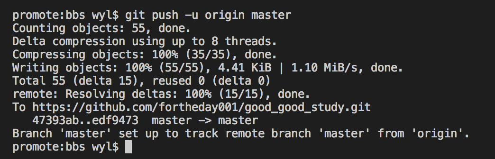

推送成功之后，我们到远程服务器上查看，代码已经全部推送到服务器上了：

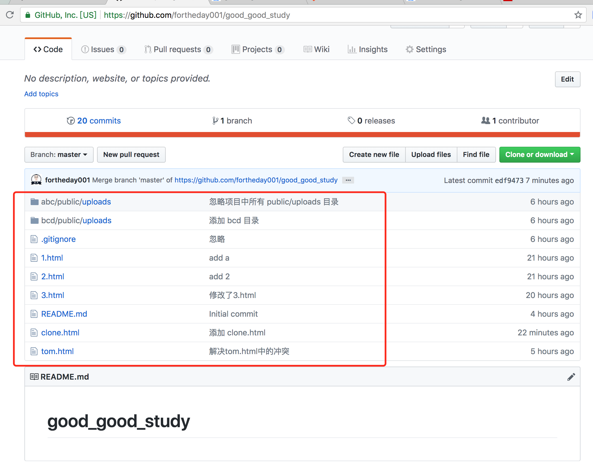


## 总结

1. 如果一个项目是使用 `git clone` 指令克隆到本地的，那么在本地直接使用 `git push` 和 `git pull` 推送和拉取数据即可。

2. 如果一个项目是已有的项目然后通过 `git remote` 后关联到一个远程仓库的，这时如果要推送和拉取的指令为：

   推送：

   第一次推送时要使用 -u 参数并且指定远程仓库名称和要推送的本地分支名：

```
   git push -u origin master
```

   以后再推送时直接使用 `git push` 即可。

   	拉取：

   第一次拉取时要指定远程仓库名和分支名，并且添加允许合并不相关历史参数：

```
   git pull origin master --alow-unrelated-histories
```

   以后再拉取时直接使用 `git pull` 即可。


## 后续的操作

有了远程仓库之后，我们以后每次编写完代码，都使用以下指令进行代码的同步：

```
git add -A                  # 将修改的文件添加到暂存区
git commit -m '注释'        # 将暂存区中的内容提交到本地仓库
git pull                   # 先拉取别人的代码合并到本地，如果有冲突先解决冲突然后再提交
git push                   # 将本地仓库推送到远程仓库
```

# 其他

## Tag
Git 也可以对某一时间点上的版本打上标签 ，用于发布软件版本如 v1.0
- `git tag v1.0`:添加标签
- `git tag` :列出标签 
- `git push --tags`:推送标签
- `git tag -d v1.0.1`:删除标签
- `git push origin :v1.0.1`:删除远程标签

## 发布
对 mster 分支代码生成压缩包供使用者下载使用，--prefix 指定目录名
`git archive master --prefix='hdcms/' --format=zip > hdcms.zip`

## 自动部署
项目中添加处理 webhook 的 webhook.php 文件内容如下，并提交到版本库。
~~~php
<?php
// GitHub Webhook Secret.
// GitHub项目 Settings/Webhooks 中的 Secret
$secret = "houdunren";

// Path to your respostory on your server.
// e.g. "/var/www/respostory"
// 项目地址
$path = "/www/wwwroot/www.houdunren.com";

// Headers deliveried from GitHub
$signature = $_SERVER['HTTP_X_HUB_SIGNATURE'];

if ($signature) {
  $hash = "sha1=".hash_hmac('sha1', file_get_contents("php://input"), $secret);
  if (strcmp($signature, $hash) == 0) {
    echo shell_exec("cd {$path} && /usr/bin/git reset --hard origin/master && /usr/bin/git clean -f && /usr/bin/git pull 2>&1");
    exit();
  }
}

http_response_code(404);
?>
~~~

### 创建站点

下面示例我使用的是 宝塔 主机面板。

现在服务器上生成了站点目录 /www/wwwroot/www.houdunren.com ，因为目录中存在 .user.ini 文件（定义站点可以访问的目录权限），造成不能 clone 代码，将目录随意改名。

开启 shell_exec

执行 git pull 指令需要使用 shell_exec 函数，删除 shell_exec 禁用函数后重启 PHP。

### clone

登录服务器并使用 https 协议 clone 项目代码

ssh root@www.houdunren.com -p 22
git clone https://github.com/houdunwang/xj.git www.houdunren.com
修改权限

chown -R www .
chmod -R g+s .
sudo -u www git pull
现在向 GitHub 推送代码后，服务器将自动执行代码拉取，自动部署功能设置完成了。

# 一些规范问题
## 建立分支
- master：当前可以用的稳定版本
- develop：主要的开发分支
- release：测试分支，主要和develop分支进行交互
- feature-xxx：用来开发某一个功能的分支，开发完合并到develop分支
- feature-xxx-fix：功能bug修复分支，feature分支合并之后发现bug，在develop上创建分支修复，之后合并回develop分支。
- hostfix-xxx：紧急bug修改分支，在master分支上创建，修复完成后合并到 master
## git 提交规范
1. git commit message 格式
    每次提交，Commit message 都包括三个部分：header，body 和 footer。
        <type>(<scope>): <subject>
        <BLANK LINE>
        <body>
        <BLANK LINE>
        <footer>
    其中，header 是必需的，body 和 footer 可以省略。
2. Header 部分
    Header部分只有一行，包括三个字段：type（必需）、scope（可选）和subject（必需）。
    (1) type （用于说明 commit 的类别，只允许使用下面7个标识）

            feat：新功能（feature）
    
            fix：修补bug
    
            docs：文档（documentation）
    
            style： 格式（不影响代码运行的变动）
    
            refactor：重构（即不是新增功能，也不是修改bug的代码变动）
    
            test：增加测试
    
            chore：构建过程或辅助工具的变动

    (2) scope （用于说明 commit 影响的范围，比如数据层、控制层、视图层等等，视项目不同而不同。）

    (3) subject (subject是 commit 目的的简短描述，不超过50个字符)

            以动词开头，使用第一人称现在时，比如change，而不是changed或changes
    
            第一个字母小写
    
            结尾不加句号（.）
    
3. Body 部分

    Body 部分是对本次 commit 的详细描述，可以分成多行。下面是一个范例。

        More detailed explanatory text, if necessary.  Wrap it to 
        about 72 characters or so. 
    
        Further paragraphs come after blank lines.
    
        - Bullet points are okay, too
        - Use a hanging indent

    有几个注意点:

        使用第一人称现在时，比如使用change而不是changed或changes。
    
        永远别忘了第2行是空行
    
        应该说明代码变动的动机，以及与以前行为的对比。

3. Footer

    Footer 部分只用于以下两种情况：

    (1) 不兼容变动

    如果当前代码与上一个版本不兼容，则 Footer 部分以BREAKING CHANGE开头，后面是对变动的描述、以及变动理由和迁移方法。

        BREAKING CHANGE: isolate scope bindings definition has changed.
    
        To migrate the code follow the example below:
    
        Before:
    
        scope: {
        myAttr: 'attribute',
        }
    
        After:
    
        scope: {
        myAttr: '@',
        }
    
        The removed `inject` wasn't generaly useful for directives so there should be no code using it.
    
    (2) 关闭 Issue

    如果当前 commit 针对某个issue，那么可以在 Footer 部分关闭这个 issue 。

        Closes #234
