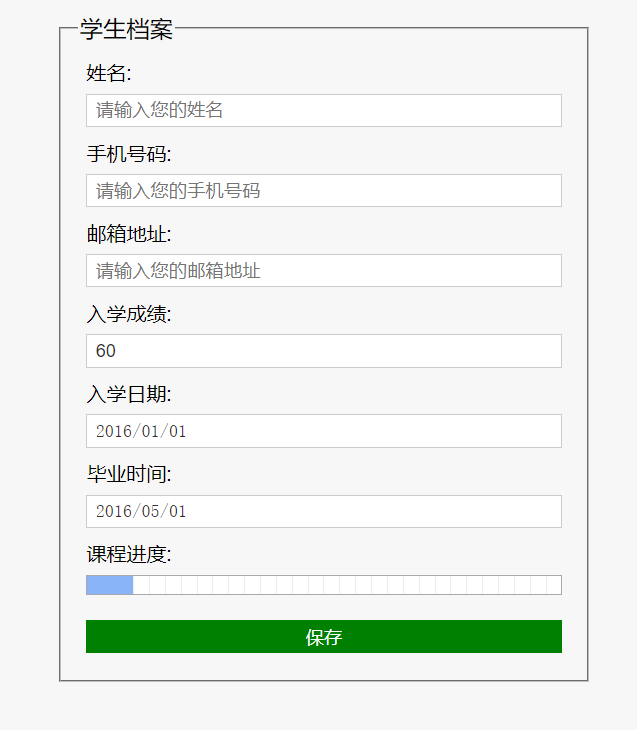

#表单
[Forms](https://developer.mozilla.org/zh-CN/docs/Learn/HTML/Forms)
`表单(Form)是 HTML 的一个重要部分，主要用于采集和提交用户输入的信息。`
*学习 HTML 表单(Form)最关键要掌握的有三个要点：*
- 表单控件(Form Controls)
-  Action 
-  Method 

先说表单控件(Form Controls)，通过 HTML 表单的各种控件，
用户可以输入文字信息，或者从选项中选择，以及做提交的操作。比
如上面的例句里，input type= "text"就是一个表单控件，表示一个
单行输入框。
用户填入表单的信息总是需要程序来进行处理，表单里的 action
就指明了处理表单信息的文件

至于 method，表示发送表单信息的方式。method 有两个值：
get 和 post。get 的方式是将表单控件的 name/value 信息经过编码
之后，通过 URL 发送(你可以在地址栏里看到)。而 post 则将表单的
内容通过 http 发送，你在地址栏看不到表单的提交信息。那什么时
候用 get，什么时候用 post 呢？一般是这样来判断的，如果只是为
取得和显示数据，用 get；一旦涉及数据的保存和更新，那么建议用
post
~~~html
    <form action="" method="get" enctype="multipart/form-data">
    ...
    </form>
~~~

## HTML 表单(Form)常用控件(Controls) 
### input 控件
*语法*：`<input type="类型" name="名" value="默认值" placeholder="提示信息" >`
*其余属性*
- autocomplete  顾名思义，自动完成，用户输入一部分，后面的自动补全。需要浏览器保存用户输入的内容，以便下一次自动补全。
- min max：这两个属性用于日期date时间time等输入，还有number和range。顾名思义，它们的作用是限制最大值，最小值
- step：和max min类似，作用是提供一个可以上下点的按钮，比如当前数字是1，你设置了step = "5"，点一下上的按钮，就变成6了。
- readonly：顾名思义，该属性会让表单空控件不可编辑。这里的不可编辑不是禁用，只是不能编辑文本而已，比如像单选框radio，复选框checkbox这种，本来就是不可编辑的，所以这个属性对它们来说毫无意义。
- disabled：该属性会禁用一个表单元素。这里是禁用，完全禁用掉除了<output>之外的所有表单元素。
- maxlength ：该属性用于限制用户输入的最大字数限制。
- size：已经没什么时候实际的作用了，控制大小现在几乎都是由CSS控制了。
- autofocus 自动聚焦
- required 必填
- pattern 自定义验证
- multiple 多选,只能用在type=file的表单中
- checked 多选和单选按钮默认选中
- selected 下拉列表默认选中
*类型*
- 一、文本类
  text，文本
  url，网络地址
  password，密码
  email，邮箱地址
- 二、操作类
  checkbox ，复选框
  radio，单选框
  file，上传文件
  number，数值
  range，百分百滑动条
- 三、功能类
  button，按钮
  image，图片提交按钮
  submit，文字提交按钮
  reset，重置表单
- 四、Date类
  date，年月日控件
  month，年月控件
  week，年周控件
  time，时间控件
  datetime，年月日+时间控件
  datetime-local，本地年月日+时间控件
- 五、特殊类
  hidden，隐藏信息
### 其他控件
多行输入框(textarea)
~~~html
<textarea name="yoursuggest" cols ="宽" rows = "高"></textarea> 
~~~
### 作业

